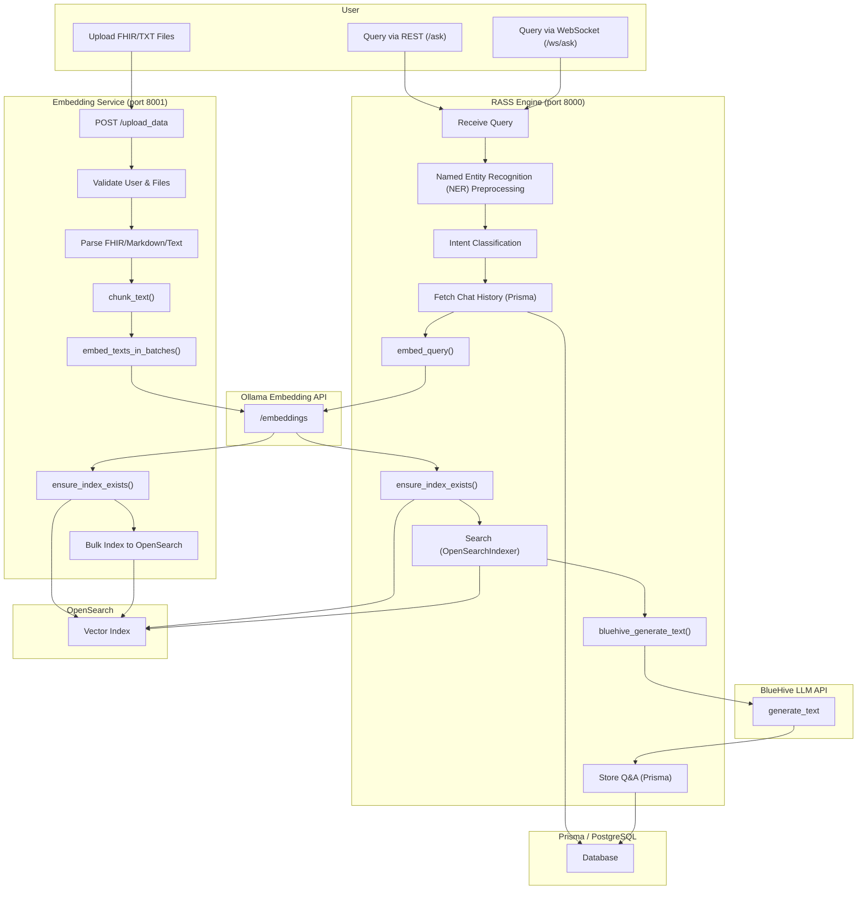

# **RASS Engine: Natural Language Search over EHR / Medical Documents**

🚀 A **Retrieval-Augmented Semantic Search (RASS)** system designed to support **natural language** or **conversational querying** on clinical and EHR documents using hybrid neural search.

🔍 Built for **fast, intelligent, and accurate retrieval** with semantic understanding, contextual responses, and access to structured and unstructured data.

---

## 📽️ Demo Videos

- **[🖥️ Usage Demo]**: See RASS in action querying EHRs using natural language. (Link to be added)
- **[🛠️ Dev Setup]**: Learn how to install, configure, and run the system. (Link to be added)

---

## 🧠 Architecture



---

## 🔑 Key Features

- ✅ **Natural language interface** using REST & WebSocket endpoints.
- 🧠 **Zero-shot intent classifier** (via HuggingFace model) determines: SEMANTIC, KEYWORD, HYBRID, STRUCTURED, etc.
- 🧠 **Named Entity Recognition (NER)** via HF model identifies the named entities for better retrieval and generation.
- 🧬 **Dynamic embedding model selection** via .env (Ollama API)
- 📂 **Upload flow** supports .json, .txt, .md files
- 🧩 **FHIR parsing, adaptive chunking, and embedding**
  - From Upload Service or RASS Engine.
  - Automatically parsed, chunked, embedded, and stored in OpenSearch.
- 🔎 **OpenSearch HNSW-based hybrid retrieval**
- 📘 **Citation-enforced LLM generation** using BlueHive or OpenAI GPT-4o.
- 🔧 **.env-controlled architecture** – zero hardcoding.

---

## ⚙️ Setup & Running

### ✅ Prerequisites

- Python 3.8+
- Local services (with appropriate ports):
  - OpenSearch
  - Ollama (any embedding model)
- PostgreSQL + Prisma ORM

---

### 📦 Install

```bash
git clone https://github.com/NeuralRevenant/RASSEngine
cd RASSEngine
python -m venv venv
source venv/bin/activate  # On Windows: venv\Scripts\activate
pip install -r requirements.txt
```

---

### 🛠️ Configure `.env`

Create `.env` (or copy `.env.example`) and define:

```env
OLLAMA_EMBED_MODEL=mxbai-embed-large:latest
OPENAI_API_KEY=...
BLUEHIVEAI_URL=http://localhost:8001/generate
OPENSEARCH_HOST=localhost
OPENSEARCH_PORT=9200
EMB_DIR=notes
POSTGRES_DSN=postgresql://...
...
```

All runtime behavior, model selection, and service ports are environment-driven.

---

### 🚀 Run the RASS Engine

```bash
uvicorn main:app --host 0.0.0.0 --port 8000
```

This will also trigger automatic ingestion from `EMB_DIR`.

---

### 📤 Run the Upload Service

```bash
uvicorn upload_service:app --host 0.0.0.0 --port 8001
```

This service handles file uploads (`.json` FHIR bundles or `.txt` medical notes), stores to disk, and calls the FHIR parser/indexer.

---

## 💬 Query API Usage

### `POST /ask`

**Sample Request - on Structured Record Data**:

```json
{
    "query": "Get details for patient Julian Stamm395.",
    "user_id": "e49a9325-916d-443b-a7be-30d292910995",
    "chat_id": "f75f6c2a-fbcd-4246-adcb-07f4e5da5e02",
    "top_k": "5"
}
```

**Sample Response**:
{
  "query": "What is Ghrelin?",
  "answer": "Patient Name: Julian Stamm395, Patient Id: XYZ, ..."
}


**Sample Request - on Unstructured Plain-text notes**:
```json
{
  "query": "What is Ghrelin?",
  "user_id": "abc123",
  "chat_id": "xyz789"
}
```

**Sample Response**:

```json
{
  "query": "What is Ghrelin?",
  "answer": "Ghrelin is a hormone that regulates appetite... (Document ABC, Document XYZ)"
}
```

### `WebSocket /ws/ask`

Streams the response token-by-token — perfect for UI integration.

---

## 📚 FHIR Ingestion Pipeline

- Handles `.json` FHIR Bundles, markdown (.md) and plain-text (`.txt`) notes.
- Uses `resourceType` to extract both:
  - Structured fields (e.g., Patient, Condition, Observation).
  - Narrative sections (e.g., `text.div`, `note[]`) for semantic embedding.
- Supports smart chunking via `CHUNK_SIZE` env var.

---

## 🔩 Tech Stack

| Layer         | Tool / Service         |
|---------------|------------------------|
| API Layer     | FastAPI                |
| Embeddings    | Ollama (any local model) |
| Retrieval     | OpenSearch (Text + Vector) |
| LLM Backend   | BlueHive / OpenAI      |
| DB Storage    | PostgreSQL + Prisma    |
| File Upload   | FastAPI Upload Service |
| Ingestion     | FHIR Parser     |
| Config        | `.env` driven          |

---

## 📁 Indexing Behavior

- Structured documents: stored with typed fields.
- Unstructured chunks: embedded with vector + narrative text.
- All records indexed in OpenSearch:
  - Supports both ANN (`embedding`) and text (`multi_match`) fields.
  - Supports HNSW parameters like `m`, `ef_construction`, and `cosinesimil`.

---

## 🔧 Dev & Debug Tips

- Change embedding model at runtime by editing `.env`:
  ```env
  OLLAMA_EMBED_MODEL=jina-embed-en
  ```
- Control chunk sizes via:
  ```env
  CHUNK_SIZE=512
  ```

---

## 💡 Future Roadmap

- [ ] LangChain + toolformer-like flows.
- [ ] Integrated frontend for querying and upload.
- [ ] Multi-hop QA support.
- [ ] Chat memory management across long sessions.
- [ ] Real-time citation-linked UI display.

---


## 🤝 Contributions & Feedback

Pull requests and issue reports are welcome! Feel free to reach out via Issues or Discussions.
