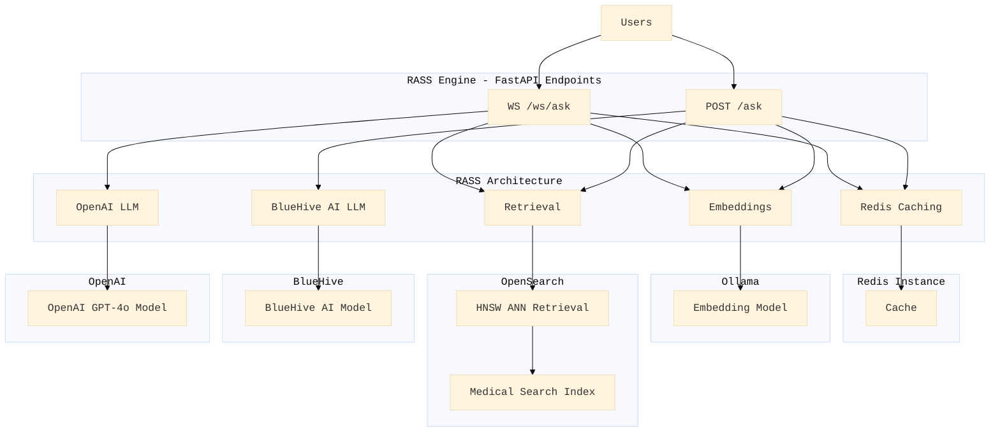

# **RASS-Based Natural Language Querying on Medical/EHR Documents**

A **Retrieval Augmented Semantic Search (RASS)** application designed for **intelligent search** on **EHR and medical document data**. The system integrates **Ollama's embedding models** for high-quality embeddings and leverages **OpenSearch** for efficient **text and vector searches**. It also utilizes **Redis** for intelligent query caching, ensuring accurate responses with near real-time latency. The users can use natural language for simple querying.

---



---

## **Key Features**
- **Search**: Uses **mxbai-embed-large:latest** (1024-dimensional vectors) via Ollama to generate high-quality **semantic embeddings**.
- **Retrieval-Augmented Semantic Search (RASS)**:
  - Combines **OpenSearch** for **text-based + ANN-based (hybrid) retrieval** with **semantic ranking** to improve query accuracy.
- **Efficient Query Caching**:
  - **Redis** caches query embeddings and responses, reducing redundant computation.
  - Uses **cosine similarity** for intelligent cache lookups.
- **Scalable Medical Document Search**:
  - **OpenSearch HNSW ANN** enables **efficient vector retrieval** at scale.
  - Supports large-scale **EHR and medical document datasets**.
- **REST API for Semantic Querying**:
  - **FastAPI-based endpoints** provide an interface for **real-time search and query answering**.
- **Robust Text Processing**:
  - **Preprocessing and chunking** of documents before embedding for optimal retrieval.
  - **Relevance ranking** ensures the most contextually appropriate results.
- **Error Handling & Resilience**:
  - **Comprehensive exception handling** for robust API performance.
  - **Fallback mechanisms** improve reliability for query execution.

---

## **How It Works**
1. **Embedding Generation**:
   - Text is converted into high-dimensional embeddings using **mxbai-embed-large:latest** via Ollama.
2. **Query Caching**:
   - Query embeddings are matched with stored results in **Redis**.
   - Cached responses are returned when a match is found, improving performance.
3. **Semantic Retrieval via ANN**:
   - If no cache hit, **OpenSearch** performs **HNSW ANN retrieval** for relevant document chunks.
4. **Contextual Query Answering**:
   - Retrieved **document chunks** are used to generate **accurate medical responses**.
   - Responses are **cached in Redis** for future queries.

---

## **Retrieval-Augmented Query Answering**
- **Endpoint**: `/ask`
- **Method**: `POST`
- **Request**:
    ```json
    {
        "body": "What is Ghrelin?"
    }
    ```
- **Response**:
    ```json
    {
        "query": "What is Ghrelin?",
        "answer": "Ghrelin is a peptide hormone secreted by endocrine cells in the gastrointestinal tract, known for its role in stimulating food intake and regulating energy balance. It acts in the central nervous system to modulate gastrointestinal functions, such as gastric acid secretion and motility, and is involved in the autonomic regulation of these functions. Ghrelin's effects on food intake are mediated by neuropeptide Y pathways in the central nervous system (Document ABC, Document XYZ)."
    }
    ```

---

## **Architecture Overview**
The system follows a **microservices-based RASS pipeline** with the following core components:
- **FastAPI**: Provides RESTful API for **semantic search** and query answering.
- **Ollama Embedding Service**: Generates **high-dimensional text embeddings**.
- **OpenSearch**: Performs **ANN-based retrieval** for document chunks.
- **Redis**: Caches query embeddings and responses for **low-latency retrieval**.

---

## **Setup and Deployment**

### **Prerequisites**
1. **Python 3.8+**
2. **Required Services**:
   - **Ollama** (running locally or in the cloud)
   - **OpenSearch** (local/cloud-based indexing)
   - **Redis** (for query caching)

### **Install Dependencies**
```bash
pip install -r requirements.txt
```

### **Run the Server**
```bash
uvicorn main:app --host 0.0.0.0 --port 8000 --reload
```

---

## **Code Highlights**

### **1. Query Caching with Redis**
- **Caches embeddings and responses**, reducing redundant processing.
- Uses **cosine similarity** for **fast retrieval** of previously seen queries.

### **2. OpenSearch Text-based + ANN-Based (Hybrid) Search and Indexing**
- **HNSW-based vector indexing** for **efficient nearest-neighbor search**.
- **Semantic ranking** ensures **relevant document retrieval**.

### **3. Dynamic Query Processing**
- Queries first check **Redis cache**.
- If no cached result, **OpenSearch retrieves relevant chunks**.
- The **retrieved text** is used for **context-aware response generation**.
- The final response is **cached for future lookups**.

---

## **Scalability & Performance**
- **OpenSearch indexes millions of medical documents** for efficient retrieval.
- **Redis caching reduces latency**, ensuring **real-time responses**.
- **Ollama embeddings improve search accuracy**, leveraging **high-quality vector representations**.

---

## **Future Enhancements**
- Implement **multi-hop retrieval** for **more complex medical queries**.
- Optimize **query expansion techniques** for **better search recall**.
- Extend **multi-modal search support** (text + structured data).
- Enhance **real-time ranking mechanisms** for **improved search relevance**.
- Develop a **full-stack user interface** for the **RASS-based medical chatbot**.

---

**Contributions & Feedback Welcome!** 🚀
